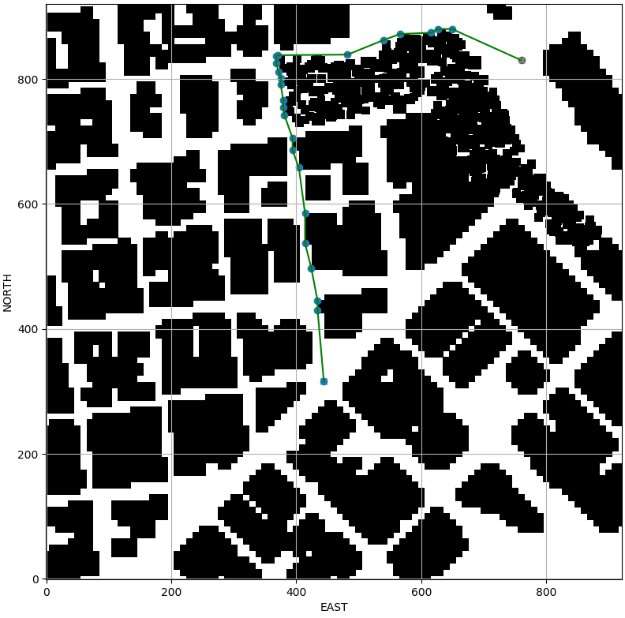

## Project: 3D Motion Planning by

# Required Steps for a Passing Submission:
1. Load the 2.5D map in the colliders.csv file describing the environment.
2. Discretize the environment into a grid or graph representation.
3. Define the start and goal locations.
4. Perform a search using A* or other search algorithm.
5. Use a collinearity test or ray tracing method (like Bresenham) to remove unnecessary waypoints.
6. Return waypoints in local ECEF coordinates (format for `self.all_waypoints` is [N, E, altitude, heading], where the drone’s start location corresponds to [0, 0, 0, 0].
7. Write it up.
8. Congratulations!  Your Done!

## [Rubric](https://review.udacity.com/#!/rubrics/1534/view) Points
---

# SUBMISSION

### The code walkthrough's are available at the below links :

- &nbsp; [`motion_planning.py`](./motion_planning.md)

- &nbsp; [`planning_utils.py`](./planning_utils.md)

The grid representation of the 2.5D map and the path generated by the A* algorithm is as below :

And here is a short demo of the drone flying through the simulator :

