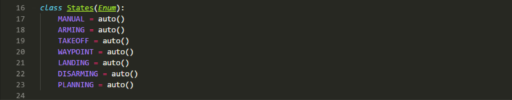

## Project: 3D Motion Planning by

### Code walkthrough as below :
---

#### 1. `motion_planning.py` 

Importing all the necessary libraries for the code functioning. Adding additional libraries like `re` for regular expression, `os` and `sys` for setting current working  directory correctly while manual debugging

Here we define all the states of the UAV using enumerations and assign a value automatically.

The class `MotionPlanning` is defined which is a child class of the udacidrone `drone` class. Whenever an class object is instatntiated, the class variables, like `target_position` ,`waypoints` and `flight_state`, are initialized. Also three callback functions for state, position and velocity changes are registered.

This is the position callback function which is triggered everytime there is a change in the position of the UAV. The function response depends on the `flight_state` variable :

> `TAKEOFF` : When the flight state is **TAKEOFF** the function checks if the UAV is within 95 % of the target altitude. When so, it calls the `waypoint_transition()` function.

> `WAYPOINT` : When the flight state is **WAYPOINT** the function checks if the UAV is within 1m of the target waypoint. If that is the case and there are no more waypoints, it calls the `landing_transition()` function. If there are more waypoints left , then the `waypoint_transition()` function is called again to proceed to the next waypoint.

This is the velocity callback function which is triggered whenever there is a change in the velocity of the UAV. This function responds only when the UAV is in the **LANDING** state and checks if the UAV altitude is within 0.1m of the global home position altitude. If so and the UAV is within 0.01m of the ground, the function calls the `disarming_transition()` function.

The `state_callback()` function is called periodically in a heartbeat fashion and is responsible for advancing the flight status of the UAV. The function responds based on the current flight status as below:

> `MANUAL` : When the flight state is **MANUAL** the function calls the `arming_transition()` function to proceed to arm and gain control of the UAV.

> `ARMING` : When the flight state is **ARMING** and the UAV is armed, the function calls on the `path_plan()` function to proceed to plan a path for the UAV to follow.

> `PLANNING` : When the flight state is **PLANNING** the function calls the `takeoff_transition()` function to make the UAV takeoff to target altitude.

> `DISARMING` : When the flight state is **DISARMING** and the UAV is not armed and not in guided mode, the function calls the `manual_transition()` function to disarm the UAV

The `arming_transition()` function performs the following tasks :

- &nbsp; Changes the flight state to **ARMING** 
- &nbsp; Arms the drone
- &nbsp; Changes control of UAV from manual to guided

The `takeoff_transition()` function performs the following tasks :

- &nbsp; Changes the flight state to **TAKEOFF** 
- &nbsp; Initiates the UAV takeoff to the target position altitude.

The `waypoint_transition()` function performs the following tasks :

- &nbsp; Changes the flight state to **WAYPOINT** 
- &nbsp; Sets the target position to the next waypooint.
- &nbsp; Commans the UAV to the target position.

The `landing_transition()` function performs the following tasks :

- &nbsp; Changes the flight state to **LANDING** 
- &nbsp; Initiates the landing pocedure of the UAV.

The `disarming_transition()` function performs the following tasks :

- &nbsp; Changes the flight state to **DISARMING**
- &nbsp; Disarms the drone
- &nbsp; Changes control of UAV from guided to manual

The `manual_transition()` function performs the following tasks :

- &nbsp; Changes the flight state to **MANUAL**
- &nbsp; Stops the drone
- &nbsp; Sets the `in_mission` variable to False

The `send_waypoint()` function sends the waypoints to the FCND Simulator for visualization purposes.

The `plan_path()` function performs the following tasks :

- &nbsp; Changes the flight state to **PLANNING**
- &nbsp; Sets the `TARGET_ALTITUDE` & `SAFETY_DISTANCE` parameters
- &nbsp; Sets the `target_position` altitude to `TARGET_ALTITUDE`

The function then reads the first line the map data ie `colliders.csv` to extract the latitude and longitude of the map center. The extracted latitude and longitude information is then used to se the home position of the UAV with 0 as the home altitude.

The current position of the UAV is obtained by the `self.global_position` method. The global position and the global home position is used to calculate the local position of the UAV in the local NED frame.

The map data is then read to create a grid representation of the map and the grid start and goal locations are defined.

After the grid start and goal have been defined, the search algorithm A* is used to find a path throught the grid. The path along with the path cost is returned by the A* function. This path is then pruned using bresenham line drawing algorithm and removing all intermediary waypoints.

The path is also plotted using matplotlib to get a visual representation of the same. The path is then converted to waypoints by adding the north offset and the east offset into the grid points returned by A*. 

The `start` function starts the connection with the UAV in the simulator and initializes the logs.

Here we are parsing the arguments for the MAVLINK connection. We then instatntiate a drone object of the MotionPlanning class. After waiting for 1 millisecond,the `start()` function is called.