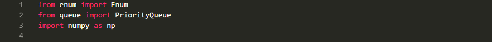
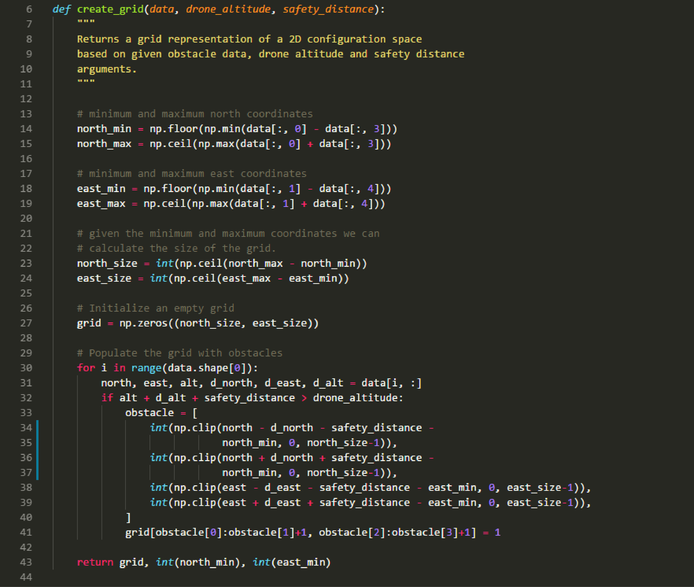
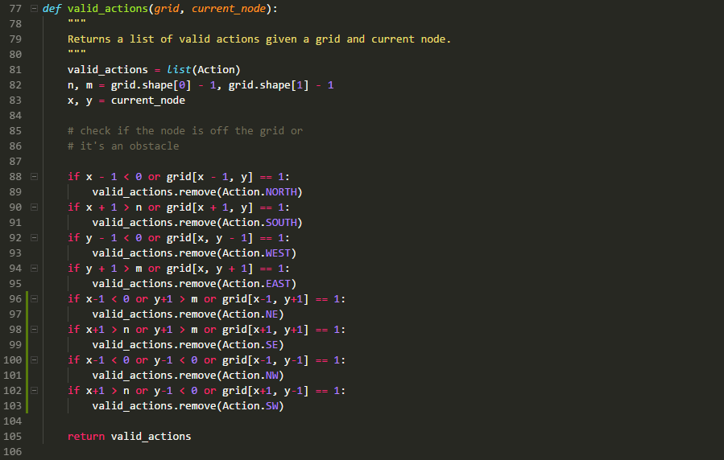
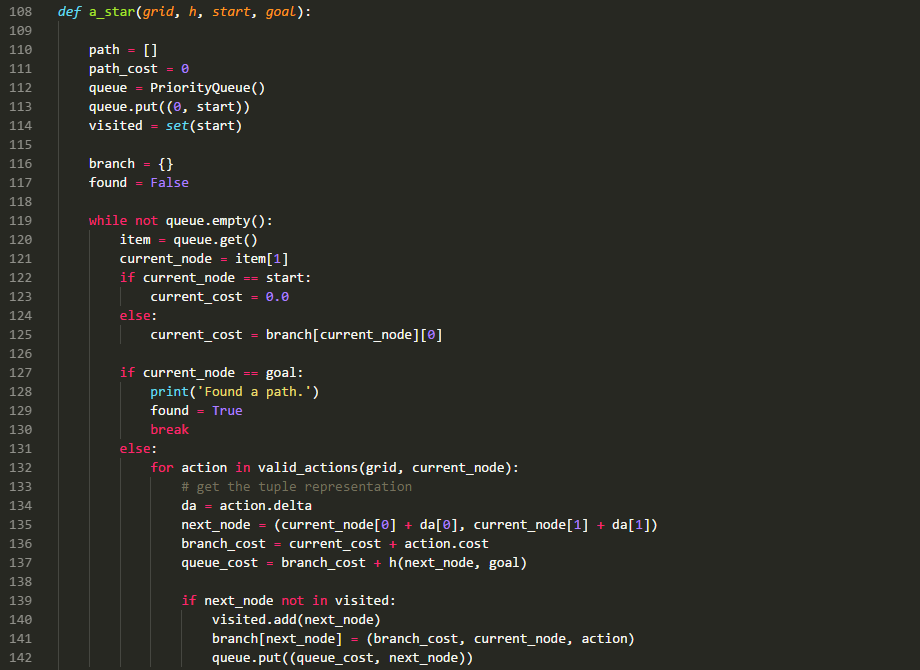
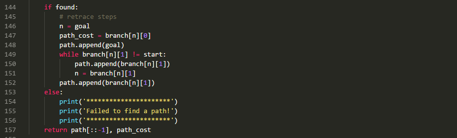
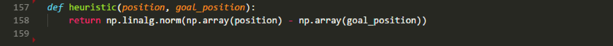
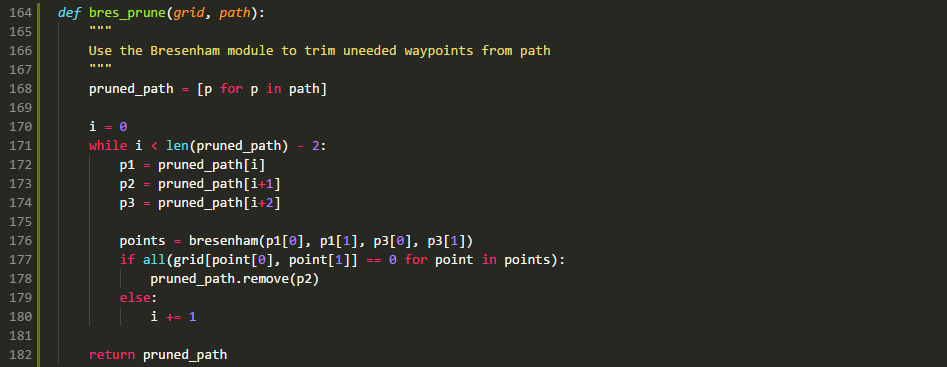

## Project: 3D Motion Planning by

### Code walkthrough as below :
---

#### 1. `planning_utils.py` 

Importing all the necessary libraries for the code functioning. Adding additional libraries `bresenham` to use for path pruning

The `create_grid()` function is used to convert the 2.5D map data from `colliders.csv` into a grid representation using a numpy array where the obstacle cells are marked as `1` and the free cells are marked as `0`. The function requires three inputs namely :

- &nbsp; `Data` : Comma searated values that represent the 2.5D map of the state search area
- &nbsp; `drone_altitude` : The altitude that the UAV will fly at.
- &nbsp; `safety_distance` : This can be though as a kind of padding around obstacles to allow the UAV to be represented as a point in the configuration space making calculations simple.

We first calculate the minimum and maximum values of the north and east coordinates of the map. The grid size is then calculated by subtracting the maximum and minimum coordinates for north and east sides. A numpy array is initialized with the obtained grid size with default value for each cell as zero. 

The `colliders.csv` file has six comma separated values representing the obstacle center coordinates in X,Y and Z directions followed by the half widths in X,Y and Z directoins. For each obstacle, defined on each line of the file, the corresponding grid cells to be marked as `1` are stored in the list `obstacle`. The grid cell range is obtained by adding and subtracting the half widths as well as the safety distances from the obstacle center. The coordinates are offset with the `north_min` / `east_min` to shift the centre to lower left. The clip function is used for boundary cells so that the cell value remains between `0` and the `north_size` / `east_size`. All the cells of he numpy array with =in the range of the list `obstacle` is then marked as `1`.

The action class provides the set of actions that the UAV can take in the grid based discretization of the 2.5D map in the `colliders.csv` file. There is also the cost associated with each action. Thus the actions are represented as a three value tuple where the first two numbers represent the delta action relative to current position. The third value is the associated cost of that actiion. The actions defined are as below :
- &nbsp; `WEST` : This action moves the UAV to one grid to the left. Associated cost `1`.
- &nbsp; `EAST` : This action moves the UAV to one grid to the right. Associated cost `1`.
- &nbsp; `NORTH` : This action moves the UAV to one grid up. Associated cost `1`.
- &nbsp; `SOUTH` : This action moves the UAV to one grid down. Associated cost `1`.
- &nbsp; `NORTH EAST` : This action moves the UAV to one grid up and one grid right. Associated cost sqrt(2) ie `1.41`.
- &nbsp; `SOUTH EAST` : This action moves the UAV to one grid down and one grid right. Associated cost sqrt(2) ie `1.41`.
- &nbsp; `NORTH WEST` : This action moves the UAV to one grid up and one grid left. Associated cost sqrt(2) ie `1.41`.
- &nbsp; `SOUTH WEST` : This action moves the UAV to one grid down and one grid left. Associated cost sqrt(2) ie `1.41`.

The class also defines two properties namely `cost` and `delta`. The `cost` property returns the associated cost with the action. The `delta` property returns the delta action associated with the action.

The `valid_actions()` functions returns the list of all valid actions for a given grid cell. The function requires two inputs namely `grid` and `current_node`. The `grid` is the numpy array representation of the 2.5D map data provided in the `colliders.csv` file. The `current_node` specifies the grid cell for which the valid actions need to be computed.

For a particular grid cell, any actions that results in any one of the below outcome, is removed from the set of valid actions being returned.
- &nbsp; Action results in moving into a cell defined as an obstacle.
- &nbsp; Action results in moving out of the grid.

The `a_star()` function is the heart of the motion planning project. The function takes in four inputs namely `grid`, `h`, `start` and `goal`.

- &nbsp; `grid` : The numpy array representation of the 2.5D map data provided in the `colliders.csv` file.
-  &nbsp; `h` : It is the hueristic function that measures the estimated cost of moving from a particular grid cell to the goal cell.
-  &nbsp; `start` : The grid cell that is defiined as the start position for the UAV.
-  &nbsp; `goal` : The grid cell that is defiined as the goal position for the UAV.

The `a_star()` function uses a priority queue to store valid actions, a set to list all the grid cells that have been visited and a dictionary to store the paths that have been explored. These are initialized and the default values populated as below :

- &nbsp; `queue`: A priority queue is created and the start grid cell is added with a cost of `0`.
- &nbsp; `visited` : A set named `visited` is created and the start grid cell is added to it.
- &nbsp; `branch` : A empty dictionary is created to store the paths explored.

While the list of valid paths is not empty ie the `queue` is not empty, or the goal has not been found, the `a_star()` function keeps on expanding on the possible actions to move closer to the goal cell. While doing so, it records all the grid cells it has visited along with the previous grid cell and the action and the cost associated to move into the grid cell.

Once the goal is found, the path is then retraced from the `branch` dictionary to define the path. This path and the cumulative cost is then retured by the function.

The `heuristic()` function returns the estimate of the cost from he current grid cell to the goal cell. The function takes in two inputs namely `position` which is the current grid cell and the `goal_position` which is the goal grid cell. Here it is the manhatten distance between the current cell and the goal cell.

The `bres_prune()` function is used to remove all the intermediary path points from the path returned by the `a_star()` function. The function start with the first three points in the path and removes the middle point if

- &nbsp; the line drawn between the first and the third point does not collide with an obstacle

If no collision is dtetected, the second point is deleted. The next point in the path is taken up and marked as the third point. The previous third point is marked as the second point and the check is repeated.

If a collison is detected , the third point is marked as the first point and next two points are taken up from the path and the process is repeated until we reach the last point in the path.